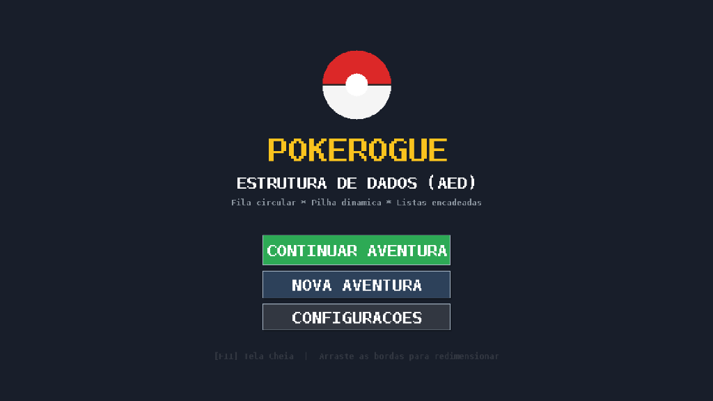

# ⚡ PokeRogue - Edição Estruturas de Dados (AED)

<p align="center">
  
</p>

<p align="center">
  
  
  
  
</p>

Um jogo de batalha e captura de Pokémon estilo *roguelike* desenvolvido em **linguagem C** com interface gráfica nativa em **SDL2**, aplicando na prática conceitos fundamentais da disciplina de **Algoritmos e Estruturas de Dados (AED)**.

---

## 🎮 Funcionalidades Principais

- 🎨 **Interface Gráfica Retrô Pixel Art**:
  - Resolução base escalável de 960x640 com renderização com aceleração por hardware.
  - Suporte completo a **Modo Janela Redimensionável** (arraste as bordas) e **Tela Cheia** (`F11` ou `Alt + Enter`).
  - 15 Pokémons desenhados em pixel art exclusivo (com nomes e referências divertidas).
  - Menus dinâmicos, barras de vida coloridas e animações de seleção.
- 🎵 **Sintetizador de Áudio Chiptune 8-bits**:
  - Efeitos sonoros gerados dinamicamente via software (sem necessidade de arquivos `.wav`/`.mp3` externos).
  - Controle de volume com ajuste fino (0% a 100%), modo mudo e atalhos de volume.
- 💾 **Sistema de Save & Continue Inteligente**:
  - Salve seu progresso pelo Lobby e continue a qualquer momento pelo menu principal.
  - Alerta de proteção contra sobrescrita acidental ao iniciar uma nova aventura.
- ⚔️ **Combate por Turnos e Desafios**:
  - Fila circular de ataques especiais com cooldowns e recargas.
  - Captura de Pokémons usando Pokébolas.
  - PokéMart (Loja) com poções de cura, reviver e suprimentos.
  - Sistema de pontuação e Hall da Fama (Ranking).

---

## 🧠 Estruturas de Dados Aplicadas

| Estrutura de Dados | Implementação | Onde é Utilizada no Jogo |
|---|---|---|
| **Fila Circular** | `Fila` (`filadeatk`) | Gerencia o ciclo de ataques do Pokémon em batalha (primeiro ataque usado vai para o fim da fila). |
| **Pilha Dinâmica** | `Pilha` (`pilhapok`) | Empilha os adversários da campanha; a cada vitória o topo da pilha é desempilhado até o chefe final. |
| **Lista Simplesmente Encadeada** | `tp_listase` | Gerencia a equipe ativa do jogador e o histórico do cemitério de Pokémons derrotados. |
| **Lista Encadeada de Loja** | `ListaLoja` | Catálogo de itens do PokéMart com preços, quantidades e regras de compra. |

---

## 🚀 Como Rodar o Projeto

Você pode compilar e executar o PokeRogue de **3 formas diferentes**:

### 1. 🐧 Linux Nativo (Recomendado para Ubuntu/Debian/Arch/Fedora)

#### Pré-requisitos:
Instale o compilador C e a biblioteca de desenvolvimento do SDL2:

```bash
# Ubuntu / Debian / Linux Mint:
sudo apt update
sudo apt install -y build-essential libsdl2-dev
```

#### Compilando e Executando:
```bash
# Compilar a versão com interface gráfica:
make gui

# Executar o jogo:
./jogoAED_gui
```

*(Opcional: Para compilar a versão clássica em terminal, utilize `make term && ./jogoAED`)*

---

### 2. 🪟 Windows Nativo

Você pode rodar no Windows de duas maneiras:

#### Método A: Executando o `.exe` pré-compilado
1. Tenha o executável `jogoAED_gui.exe` gerado.
2. Certifique-se de que a biblioteca `SDL2.dll` (64-bit) está presente na **mesma pasta** do executável.
3. Dê dois cliques em `jogoAED_gui.exe` para jogar!

#### Método B: Compilando no Windows (via MSYS2 / MinGW)
1. Instale o [MSYS2](https://www.msys2.org/) e abra o terminal `MSYS2 MinGW 64-bit`.
2. Instale o GCC, Make e SDL2:
   ```bash
   pacman -S mingw-w64-x86_64-gcc mingw-w64-x86_64-SDL2 make
   ```
3. No terminal, navegue até a pasta do projeto e execute:
   ```bash
   make win
   ./jogoAED_gui.exe
   ```

---

### 3. 🍷 Wine no Linux (Testar a versão Windows dentro do Linux)

Se você está no Linux e quer compilar e testar exatamente a versão `.exe` do Windows sem precisar reiniciar o computador para o Windows em dual-boot:

#### Pré-requisitos:
Instale o compilador MinGW para compilação cruzada (*cross-compilation*) e o Wine:

```bash
sudo apt update
sudo apt install -y mingw-w64 wine
```

#### Compilando e Rodando com 1 Comando:
O projeto já conta com um script automatizado que baixa os cabeçalhos e a DLL do SDL2 para Windows caso ainda não existam:

```bash
# Baixa as dependências e compila jogoAED_gui.exe para Windows:
make win

# Executa o executável Windows pelo Wine:
make wine
```

---

## ⌨️ Controles e Atalhos

| Tecla / Ação | Função |
|---|---|
| **Botão Esquerdo do Mouse** | Navegação por menus, seleção de opções, botões de ação e ataques |
| **F11** ou **Alt + Enter** | Alternar entre Modo Janela e Tela Cheia a qualquer momento |
| **Arraste nas Bordas da Janela** | Redimensiona livremente a janela preservando a proporção de tela |
| **Esc** | Voltar ao menu anterior / Cancelar telas modais |
| **Enter / Espaço** | Confirmar opções rápidas e avançar diálogos |

---

## 📁 Estrutura de Diretórios

```
.
├── assets/             # Imagens e pré-visualizações da interface
│   └── preview.png
├── include/            # Cabeçalhos (.h) de estruturas e interface
│   ├── gui.h           # Lógica central da aplicação gráfica e cenas
│   ├── gui_draw.h      # Primitivas visuais e renderização de pixel art
│   ├── gui_audio.h     # Sintetizador de som 8-bit procedural
│   ├── savegame.h      # Serialização e persistência de dados
│   ├── pokemon.h       # Estruturas de Pokémon e Fila de ataques
│   ├── jogador.h       # Dados do treinador e Lista de Pokémons
│   ├── loja.h          # PokéMart e lista de itens
│   ├── ranking.h       # Hall da Fama e leitura/escrita de scores
│   └── utils.h         # Funções utilitárias
├── src/                # Código-fonte (.c)
│   ├── main_gui.c      # Ponto de entrada da interface gráfica
│   ├── gui.c           # Implementação das telas e lógica de jogo
│   ├── gui_draw.c      # Desenho de botões, sprites e fontes
│   ├── gui_audio.c     # Síntese e fila de áudio SDL
│   ├── savegame.c      # Leitura e escrita de saves binários
│   └── ...
├── scripts/            # Scripts auxiliares para compilação multiplataforma
│   └── setup_windows_build.sh
├── Makefile            # Automação de compilação (Linux, Windows e Wine)
└── README.md
```

---

## 👥 Autores

Projeto desenvolvido com foco acadêmico para o aprendizado prático de **Algoritmos e Estruturas de Dados (AED)**.
